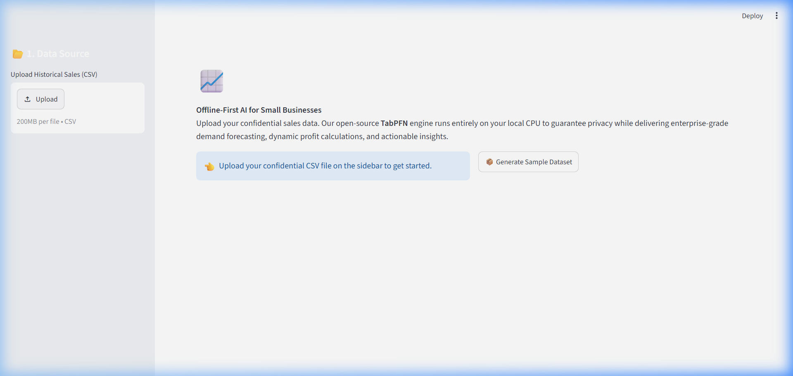

# 🥐 BakePredict Pro: Enterprise Inventory Forecaster



BakePredict Pro is an offline-first, privacy-focused AI inventory predictor designed specifically for small businesses, bakeries, and local shops. It utilizes the **TabPFN** foundation model to deliver enterprise-grade demand forecasting and actionable business insights without ever sending your confidential financial data to the cloud.

Built for the **DEV Hacktoberfest Weekend Challenge (Build for a Friend)**.

## 🚀 Key Features

- **🔒 100% Offline & Private:** Uses local open-source AI (TabPFN). Your sales data never leaves your computer. No API keys, no subscriptions, no data harvesting.
- **📈 7-Day AI Forecasting:** Simulates the upcoming week and predicts demand levels based on historical data, weather, and day of the week.
- **💰 Dynamic Profit Calculator:** Input your cost and selling price to see projected profits alongside your AI forecasts.
- **🌤️ Live Weather Simulation:** Adjust tomorrow's expected temperature and watch the AI dynamically update its predictions.
- **🧠 Actionable Business Insights:** Automatically generates plain-English recommendations to optimize profit and reduce food waste.

## 🛠️ Technology Stack

- **Frontend:** Python, Streamlit
- **Data Visualization:** Plotly
- **Machine Learning:** TabPFN, Scikit-Learn, Pandas, Numpy

## 💻 Getting Started

### Prerequisites
Make sure you have Python 3.9+ installed.

### Installation

1. Clone this repository:
```bash
git clone https://github.com/abhijeetnardele24-hash/bakepredict.git
cd bakepredict
```

2. Install the required dependencies:
```bash
pip install -r requirements.txt
```

3. Run the application:
```bash
python -m streamlit run app.py
```

### Usage
1. Open the local URL provided by Streamlit (usually `http://localhost:8501`).
2. Click **"Generate Sample Dataset"** to create a test CSV file if you don't have your own.
3. Upload your historical sales CSV file on the left sidebar.
4. Adjust your profit margins and simulated weather.
5. Click **"Train Open-Source AI & Predict 7 Days"** to view your dashboard!

## 🤝 Contributing
Contributions, issues, and feature requests are welcome! Feel free to check the [issues page](https://github.com/abhijeetnardele24-hash/bakepredict/issues).

## 📄 License
This project is open-source and available under the [MIT License](LICENSE).
